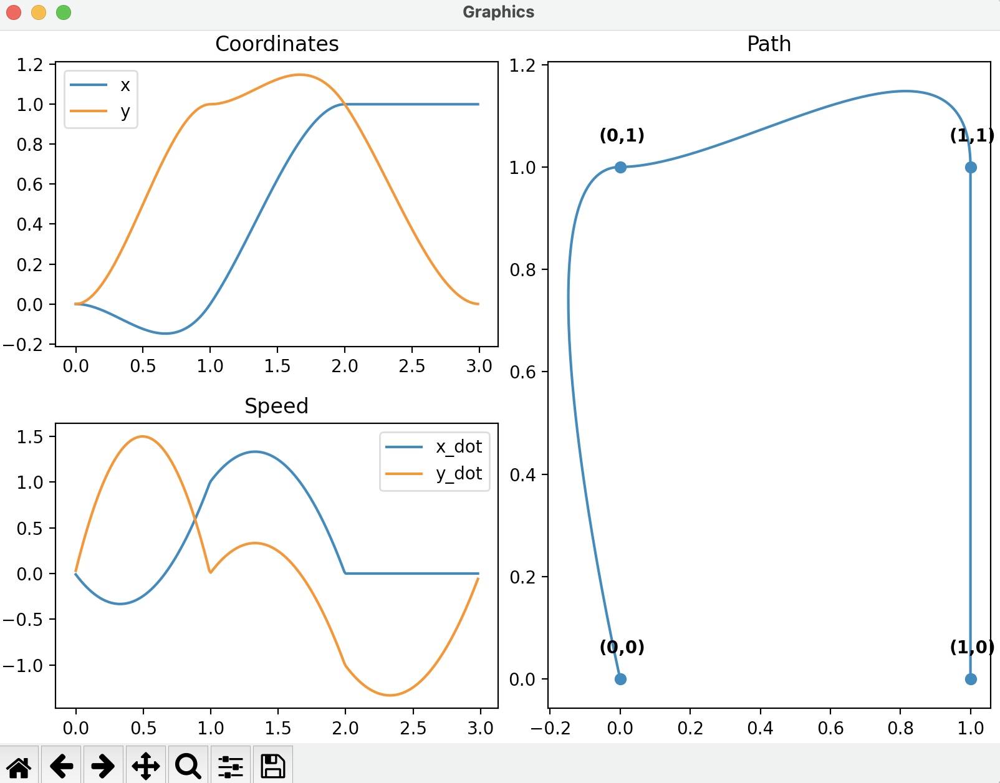

# Моделирование информационных процессов

**Задание:** Реализовать интерполяцию траектории с несколькими точками
(параграф 9.3)

Установка зависимостей
```
pip3 install poetry
poetry shell && poetry install
```
Запуск программы:
```
python3 main.py
```

# Вывод
